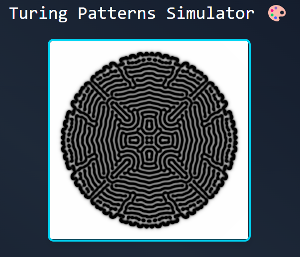
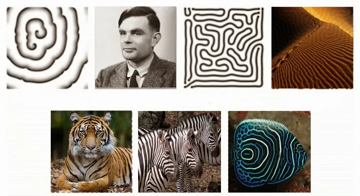
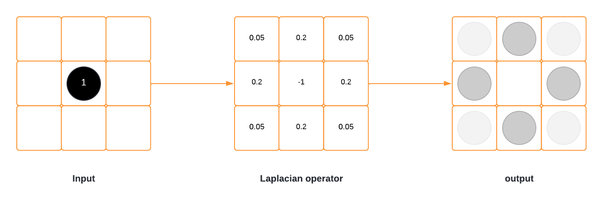

# Turing Patterns Simulator

This page, developed with React, Tailwind, and JavaScript, allows users to play with and simulate Turing patterns by adjusting the feed and kill parameters in real time.

The first version of this software is very simple and limited; it was built in a day and does not aim to be perfect but rather to demonstrate that it is possible to generate beautiful patterns with very few lines of code. Turing patterns are widely found in nature, and as a nature enthusiast, this motivated the development :)

The patterns take between 2 to 4 minutes to take shape because the calculations are executed in vanilla JavaScript. Future versions will implement hardware acceleration for faster generation and to allow for larger canvases.

The Gray-Scott model was implemented in a React hook that updates the state of the canvas.

$$
∂A/∂t = Dₐ∇²A - A*B² + f*(1-A)

∂B/∂t = Dᵦ∇²B + A*B² - (k+f)*B
$$

The basic operation of the software is understood by grasping the Laplacian operator, which acts as a mask indicating how a pixel disperses from one frame to another. With this foundation, most of the work is already done.

